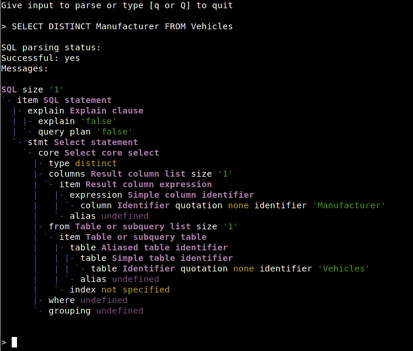

SQL parser front end
====================

This package provides a reduced shell for parsing SQL statements and serves as
an interactive demonstration tool for SQL parsers generated by ``lib-sql-text``
[1] and it's dumper ``lib-dump-sql`` [2].

[1] https://github.com/cviebig/lib-sql-text

[2] https://github.com/cviebig/lib-dump-sql

Options
-------

::

   SQL parser:
     -h [ --help ]          produce help message
     -g [ --generator ] arg Output generator (console, plaintext, latex)
     -s [ --statement ] arg SQL statement(s) to parse
     -i [ --interactive ]   Interactive mode, prompting for inputs
     -o [ --stdout ]        Force use of stdout for all outputs

Invocations
-----------

``--interactive``:

Piping from stdin
^^^^^^^^^^^^^^^^^

Using the interactive switch it's also possible to run it in a batch mode by
piping sql queries to standard input. In `res/ <res/>`_ you can find parse trees
of Star Schema Benchmark queries (`sql <res/ssb.sql>`_) produced by `res/ssb.sh
<res/ssb.sh>`_:

- `Plain text <res/ssb.txt>`_
- `ANSI color coded output <res/ssb.ansi>`_ which is highlighted by shells
- `LaTeX <res/ssb.tex>`_ (PDF: `Github viewer <res/ssb.pdf>`_, `Download
  <https://github.com/cviebig/bin-dump-sql-text/raw/master/res/ssb.pdf>`_)
